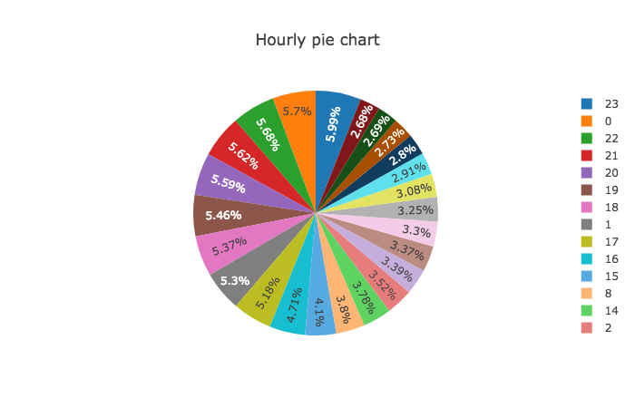
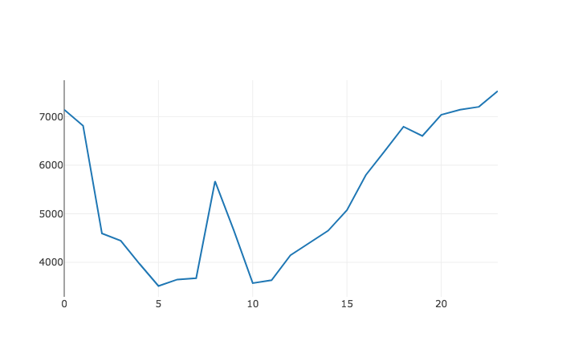

# spark-playground
Spark playground

## Description
The aim of this task is to extract data from JSON files via spark and save the files to CSV with the **idempotent** approach, meaning that if we will run the same data set over and over again on a specific day the data will be overwritten.

For example the default results will be sent to:
`./output/date=2015-01-01/<filename>.csv`

### Note 
Using CRON (scheduler) and supporting any scale are built in
`Databricks`, so there is no point in implementing that for a managed service
that was built for spark, by the spark developers.


## Installation
1. Install python3.7
1. Clone this repo
1. `cd spark-playground`
1. Run: `sh install.sh -c`
1. Activate virtual environment: `source venv/bin/activate`

## Download files - prerequisite to running the code
1. `wget http://data.gharchive.org/2015-01-01-{0..23}.json.gz -P input` => input folder is the default but can be replaced by using the `-i` option when running the code.

## Running the code
1. Run: `python main.py --help` for all the options
1. Run: `python main.py -c type -v PushEvent -g scatter`

## Examples

### Run Options
`python main.py --help`

```
usage: main.py [-h] [-i INPUT] [-o OUTPUT] [-c COLUMN]
               [-v VALUES [VALUES ...]] [-g GRAPH] [-d]

Generate spark parser

optional arguments:
  -h, --help            show this help message and exit
  -i INPUT, --input INPUT
                        Input folder
  -o OUTPUT, --output OUTPUT
                        Output folder
  -c COLUMN, --column COLUMN
                        Filter by column: e.g. type
  -v VALUES [VALUES ...], --values VALUES [VALUES ...]
                        Filter by a list of values with OR: e.g. -v PushEvent
                        -v OtherEvent
  -g GRAPH, --graph GRAPH
                        Supports: [pie, scatter]
  -d, --debug           Show mid work spark content
```

### Debug mode

Running the following command will produce a debug mode to display the results that will be written to the output file.
**Note:** use this mode wisely since running it on one year of data will slow down the system.

This is the recommended mode for local runs:
`python main.py -d`

```
|:-------------------------------------------:|
| |date      |hour|events|events_percentage | |
| +----------+----+------+------------------+ |
| |2015-01-01|0   |6641  |5.5693463712450315| |
| |2015-01-01|1   |6348  |5.32362758088593  | |
| |2015-01-01|2   |4280  |3.589339326747287 | |
| |2015-01-01|3   |4150  |3.4803173378507575| |
| |2015-01-01|4   |3670  |3.077774609617417 | |
| |2015-01-01|5   |3292  |2.760772211133661 | |
| |2015-01-01|6   |3445  |2.8890827057580384| |
| |2015-01-01|7   |3495  |2.931014239949011 | |
| |2015-01-01|8   |5474  |4.590664363227722 | |
| |2015-01-01|9   |4420  |3.7067476224820113| |
| |2015-01-01|10  |3349  |2.80857416011137  | |
| |2015-01-01|11  |3413  |2.8622465238758155| |
| |2015-01-01|12  |3820  |3.2035692121903354| |
| |2015-01-01|13  |4111  |3.447610741181798 | |
| |2015-01-01|14  |4284  |3.592693849482565 | |
| |2015-01-01|15  |4672  |3.9180825548045153| |
| |2015-01-01|16  |5361  |4.495899095956123 | |
| |2015-01-01|17  |5815  |4.8766374264101575| |
| |2015-01-01|18  |6330  |5.308532228577179 | |
| |2015-01-01|19  |6146  |5.154224182754398 | |
| |2015-01-01|20  |6560  |5.501417285855655 | |
| |2015-01-01|21  |6594  |5.529930729105517 | |
| |2015-01-01|22  |6614  |5.546703342781906 | |
| |2015-01-01|23  |6958  |5.8351922980158   | |
```

### Filter Mode
Choose column and filters with the `-c` `-v` commands respectively.
The `-v` command can be repeated and will produce a list of values to be compared
with IN (same as IN acts in SQL).

#### Note 
Currently supports only root level parameters of the json (=> json_object.keys())

`python main.py -c type -v PushEvent -v PullRequestEvent -d`

### Graph Mode
Choose a graph to your liking: currently supports: Scatter / Pie.

**Note:** Added reflection to display the supported types in case of user error in choosing the correct type.

`python main.py -g pie`





`python main.py -c type -v PushEvent -v PullRequestEvent -g scatter`




**Checkout the HTML files that represents the results of the above commands in a much better UI with hover and many other functionalities as fit to a chart, if you can see them correctly just run the code and they with automatically pop up with the Graph Mode commands**
